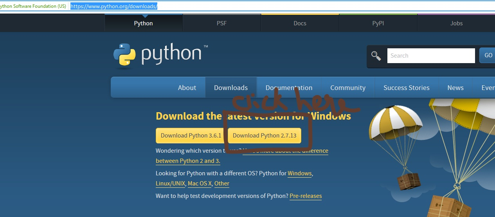

```{r setup, include=FALSE}
knitr::opts_chunk$set(echo = TRUE)
knitr::opts_chunk$set(engine = "python")
knitr::opts_chunk$set(comment = "Out:")
```

#How to read this book
This is a *tiny, tiny* book. It was meant to be tiny. It's 50 pages. Without the lab exercises it's 32 pages. Why? Brevity.

The best way to *teach* is **by example**. That is what this book does. The explanation is kept purposefully concise as examples do the talking. 
If, at times, you feel the explanation is not enough, be patient and complete the examples. Although the lab examples are in a seperate section, they form a good repertoire of examples. So don't skip them. 

The best way to *learn* is **by doing**. **It is highly recommended that you type each line of code in the book.** That, I believe, is the best way to get the maximum out of this book.

Finally, this book is meant to be quick read. It is not a python encyclopedia. However, it does cover quite a lot of ground. It is meant to be quick but thorough book on Python basics. Experienced programmers(who have experience in other languages) can directly code up the code listings. They can skim/skip the explanation part.

#Introduction

##History of python
Python was created by Guido van Rossum in 1991.

##Need of python programming
C, C++ are powerful langauges. Langauges that can be used to write a variety of software. They give you very minute control of the machine. But, they are very low level. We need to specify every small detail. For example, we have to create and manage memory, object destruction etc, when all we need to do is save a few objects. 

C, C++ syntax makes writing code very lengthly. C, C++ focus on reducing memory, running programs fast etc. Python's focus is to reduce developer time-time taken by the programmer to create software. C's 20 line code would be 5 or less lines long in python.

##Applications
Python's concise code makes it real quick to write software. It's high level. Python is used for the real software that we see often in our day-to-day life.

####Web development
Django is popular python framework(a big library is called a framework) that simplifies building websites. Popular websites like Instagram, YouTube, BitBucket, Pinterest
use Django/python.

####Data Science and Maching Learning
Data science is different from the general programming. In general programming, finding out the average of subjects marks is a typical programming problem. Data science trys to predict the answer to question 'When will you come to college tommorow?' It does it by observing previous data. Since you came at 8:30 everyday for the past 6 months, you will come tommorow at 8:30. This is simple problem but typical problems in this field are like 'what is chance of getting cancer if you have a family history?' 'what will the whether be today?' etc. Two langauges dominate this field - Python and R. Both of which are in your syllabus. 

####Gaming and GUI applications
The famous game Civiliztion IV, where you get build an empire, was written in python.

####Internet of Things(IoT)
Our calculators are computers. Not as powerful as our laptops but still are computers. Iot is a technology where, small calculator sized but more powerful computers are attached to everyday devices like TV, Fridge, AC to make them smart. The smart house; where you can voice operate lights, doors, music; is becuase of iot. And, python is the primary language of this field.

####Natural language processing
Did you try giving voice commands to your smart phone? Isn't it cool? The phone listens and finds out what you are talking out. It does this even if an accent is present. This field  is called natural language processing. Python has cool librabies for this too.

##Setup
Download python from here: https://www.python.org/downloads/. 

JNTUK does not specific which version to download. Python has two main versions. Python 2 and python 3. Download python 2. At the time of writing this book(July 2017), the latest verision was 2.7.13. Once you download the exe file, just double click and install. Press next to keep the default folder as 'C:\\Python27\\'. On the 'Customize Python 2.7.13', select the feature, 'Add python.exe to Path'. Make sure that this feature is selected( no cross mark adjacent to this feature) Press next and the installation should be complete. This should be very easily.

<!--  -->
Congrats! You now have python installed on your machine.

##Using the python interpreter
Click on windows start and find python. In windows 7 and above, you could just type in python and in the search results something like **python(command line)** will come up. Click on that, and a black screen will come. That is called the **python interpreter**. 
That is where we will run all our python code. We will open this black screen each time we need to do some coding, so become comfortable opening up this application.

##(Optional ipython installation)
All python code in this book can be done on the python interpreter we just installed. However, ipython is a better tool that the python interpreter. I highly recommend that you install ipython as well. If you do install it, use ipython whenever I say python interpreter.

Installation steps:

Ipython requires visual c++. It can be downloaded at `http://aka.ms/vcpython27`. Download and install this software. It is pretty easy and shouldn't cause any troubles.

Open windows command line by pressing the windows key + r. Or search for an app called `run` from the start button. Type 'cmd' and press enter. A black screen will be launched, it's called the windows command prompt.

Now install `ipython` using `pip`. `pip` is utility command to install python modules.
```{bash, eval=FALSE}
pip install ipython
```

##Using ipython:
Open the windows command prompt again like in the previous step(windows key  + r, type 'cmd', enter). Type
```{bash, eval=FALSE}
ipython
```
Remember, you can use either use the python interpreter or ipython.


##REPL
Open the **python interpreter** and type in the following one line at a time:
```{python, eval=FALSE}
2 + 3
45 + 21.1
45/9
```
```{python, echo=FALSE}
print 2 + 3
print 45 + 21.1
print 45/9
```
Each line you typed above is a command for the python interpreter. It reads your command, evaluates it and prints the result. When you type `2 + 3`, python took this command, calculated the sum and then printed it. Again the same steps of reading, evaluating, printing happened for the second command. This loop is called the **read-eval-print-loop**. And the python interpreter is also called the **python repl**. The nice thing about python repl is it also works as a calculator as seen above. 

You can even type in a complex expression like:
```{python}
print 'sree' in 'sreekanth'
```
Don't worry what this expression does. For now, just remember you can type **any python expression**.


##Running python scripts
Save the previous code listing into a file and name it script.py. run that file using the command 
```{python, eval=FALSE}
run script.py
```

All python files should end with '.py'. You can give them any name(following the rules of variable naming).

##Variables and Assignment
In programming, we often need to save some number, some information somewhere so that we can use it later. Variables are used to save such infomation.
```{python}
age = 32
name = 'sreekanth'
```
Here, `age` is variable to which the infomation 32 is saved. `name` is another variable to which the infomation `'sreekanth'` is saved. We can see what infomation a particular variable has simply by printing them(don't worry about the quotes, we will get to that when we learn about strings).
```{python, eval=FALSE}
print age
print name
```
```{python, echo=FALSE}
age = 32
name = 'sreekanth'
print age
print name
```
`print` is the built-in python command to print variables or values. More on that later. We could also modify the infomation assigned to a variable.
```{python, eval=FALSE}
age = age + 10
print age
name = name + ' kolamala'
print name
```
```{python, echo=FALSE}
age = 32
age = age + 10
print age
print 'sreekanth kolamala'
```
Here, we are assigning the variable `age`, the previously saved `age` and 10 more. So, now the `age` would have the infomation `42`.

If you are familar with C or java, you would noticed that there is not variable declaration like `int age = 32;`. In python, you don't need to declare variables before assigning some infomation. You just use them. Also, the semicolon `;` is optional in python. 


##Keywords
Each langauge has a set of words that are reserved. They can't be used as variable names. The complete list is given here as referance. You don't need to know them by heart. This is just for your reference.

| | | |
------------|-------|-----------|------|----------
| False 	| class | 	finally |	is | 	return 
|  in	| continue | 	for |	lambda | 	try 
| True 	| def | 	from |	raise | 	while 
| and 	| del | 	global |	not | 	with 
| as 	| elif | 	 if  |	or | 	yield 
| assert 	| else | 	 import | 	pass 	 | except
| ||break| 	 	  

<!-- You can also get the complete set of keywords using this program. -->
```{python, eval=FALSE , echo=FALSE}
import keyword
print keyword.kwlist
```
The rest of unit will make more sense in unit-2 and hence is covered in unit-2.

<!-- ## Indentation -->
<!-- covered in if section -->
<!-- ```{python, error=TRUE} -->
<!-- print 'this line will be printed' -->
<!--   print 'this will cause indentation error' -->
<!-- ``` -->

<!-- We will talk about indentation more when we talk about if statements. But, for now remember to indent all the statements uniformly. -->

\newpage

#Types, Operators and Expressions
##Types
Varaibles based on what operations we can do on them are group into so called **Data types**.
Python has 5 data types - `Numbers, Strings, Lists, Tuple, Dictionary`. In this chapter, we will discuss Numbers and Strings. We will see the other 3 in the next chapter.

###Numbers
Numbers are further divided into 4 - `int, long, float, complex`. 

`int` and `long` are used to represent whole numbers. `float` is used for numbers that have a decimal part. Languages like C have double type for really big floating point numbers. But, Python only has float. 
```{python}
a = 12
print type(a)
#type is a built-in function that returns the type of a variable
b = 12.3
print type(b)
c = 2323231211142342424
print type(c)
d = complex(2,3)
print d
print type(d)
```
The data type `complex` represent mathematical complex numbers that have a real and an imaginary part.

###Strings
Strings are used for saving text like `'India'` or `'Cake'`.Strings can be surrounded with either single quotes or double quotes. Unlike in C, there is not difference between char and string-both are same.
```{python}
name = "sreekanth"
occupation = 'software engineer'
print type(name)
qoute = "I'm good" #observe that a single qoute can be used within double quotes
print "qoute:" + qoute
qoute = "qoute:" + 'He said "I am not going" to her'
print qoute
```
You can have a 1 single quote within 2 double quotes or vice versa. But, you can not have a 1 single quote within 2 single quotes. Same with double quotes.
```{python, error=TRUE}
qoute = "He said "I am not going" to her" #this will not work.
```
###Booleans
`int` variables can be assigned any whole number. `string` variables can be assigned any charecters. Boolean variables are special. They can be assigned only 2 values - `True` or `False`
```{python}
flag = True
print flag
flag = False
print flag
```

##Input-Output
It's not always the case that variables are assigned in code. Often times, an input from the user is used.
```{python, eval=FALSE}
# Input
a = raw_input("enter a number:")
```
`raw_input()` always takes the input as string. Even if you type numbers, they would be taken as string. So, if you really want to input numbers, you need to convert them. We use the built-in python functions `int()` , `float()` for this.
```{python, eval=FALSE}
a = raw_input("enter a number:")
print a
print type(a)
# type is built-in functon that tell the type of anything
a = int(a)
print type(a)
```
```{python, echo=FALSE}
a = '23'
print "enter a number:" + a
print a
print type(a)
a = int(a)
print type(a)
```
Python programmers combine the input and conversion into one line like this:
```{python, eval=FALSE}
age = int(raw_input('enter age'))
height = float(raw_input('enter height'))
```
By now, I guess you are comfortable with printing. Few more examples:
```{python}
print 'some-string'
print 23
# to print multiple variables on the same line:
print 'some-sting', 23, 45.5
```

## Operators
Variables are assigned values using the `=` operator. Variables are written when they are first assigned a value.
```{python}
number = 10
```
The variable `number` is assigned `10`. Note that the type of the variable `number` is not declared. This is not required because of the python type inference. Based on the operations we do on the variable, python will automatically guess its type. Isn't that cool?
```{python}
#multiple assignments can be done in the same statement simultaneously.
a, b = 10,20
#a is assigned 10 and b is assigned 20.
print a,b
a,b = b,a
#a is assigned the value in b and b is assigned the value in a simultaneously. 
#this is a popular way of swapping numbers in python.
print a,b
```

### Arithmetic Operators
Arithmetic operators are used for doing comman arithmetic operations like addition, substraction etc. They are `+ - * / % **`. For example, `2/3` is `2` divided by `3`.

`a%b` is gives the reminder when `a` is divided by `b`. `a**b` gives a to power of `b`. Few examples for clarity are given in the table below.

| operator       | example | result
--------------|---------|------
|    +  |  2 + 3       |5
|     -  | 2.3 - 3.5      | -1.2
| `*`  | 2\*1.5 | 3
| / | 5/2 | 2
| % | 5%2 | 1
| `**` | 5\*\*2 | 25
### Relational Operators
Relational operators include `>, >=, <, <=, ==, !=`. They take 2 operands and return a boolean result(`True` or `False`). For example, the __greater than__ operator (`a > b`) returns `True` if `a` is bigger than `b`. Following table contains examples for other operators.

| operator       | example | result
--------------|---------|------
| > | 20 > 40 | False
|| 20 > 20 | False
| `>=` | 20 >= 20 | True
| < | 20 < 40 | True
|| 20 < 20 | False
| <= | 20 <= 20 | True
| == | 20 == 20 | True
||  20 == 40  | False
| != | 20 != 20 | False
||  20 != 40  | True

### Logical Operators

There are three logical operators: `not, or, and`. `'not a'` evaluates to the opposite of what `'a'` is. `'a and b'` evaluates to `True` only if both a, b are `True`.
`'a or b'` evaluates to False if both a,b are `False`. They behave exactly like `!, ||, &&` operators in C.
```{python}
condition = True
print (not condition)
print (condition or False)
print (condition and False)
```

|     a   | not a       |
----------|--------------
|     True   | False       |
|     False  | True       |

|     a   | b      | a and b  | a or b
----------|--------------|-----|-----
|     True   | True       | True  | True
|     True  | False       | False | True
|     False   | True       | False  | True
|     False  | False       | False  | True

## Control flow
Often times, instead of letting each line execute, we would need to selectively execute some lines. This can be done by `if`, `if-else`, `if-elif-else` blocks.
### if, if-else, if-elif-else
```{#numCode .python .numberLines}
a,b = 3,2
if a > b:
  print "a is greater than b" #Notice this print stmt is indented 
  #this means that the print stmt is within the if block
```
The `if` block is executed only if the condition is `True`. In the above code, line 3,4 are executed only if `a` is greater than `b`. Python seperates blocks based on their indentation. Line 3,4 are within the if block and will only execute if the condition is True. Notice unlike other langauges, python doesn't use curly brackets{} for creating blocks. More examples:
```{python}
a,b = 3,2
if a < b:
  print "this statement is within the if block"
  print "this statement aswell"
else:
  print "this statement is in the else block"
  print "this statement is also in the else block"
print "this statement is not in the if block. it's in the global block and will always print"
```
Here, the condition `a<b` will result in `False`.The `if` block will be skipped and the `else` block will be executed.
```{#numCode .python .numberLines}
a,b = 10,20
if a > b:
  print "a is greater than b"
else:
  pass
```
```{python,echo=FALSE}
a,b = 10,20
if a > b:
  print "a is greater than b"
else:
  pass
```
`pass` is a keyword that represents an empty statement. It's is like an empty ; in C. Again, observe the indentation. Line 3 is inside the if block and line 5 is inside the else block.

We can check more than 1 condition using the `if-elif-else` block.

**syntax**
```{python, eval=FALSE}
if condition_1:
  stmts_1
elif condition_2:
  stmts_2
else:
  stmts_3
```

| condition_1       | condition_2 | stmt executed
--------------|---------|------
|    True  | _      | stmts_1
|     False  | True      | stmts_2
| False  | False | stmts_3


```{python}
if False:
  print 'this will not print'
elif True:
  print 'this will be printed'
else:
  print 'this will not too'
```
We will cover the rest of unit-2 in unit-3 once we are done with lists.

### Terary operator
Terary operator is a shorter form of an if-else statement.

*syntax:*
```{python, eval=FALSE}
expression-1 if condition else expression-2
```

```{python}
number = 24
result = "odd" if number % 2 != 0 else "even"
print result
```

\newpage

#Data Structures

##Lists

Lists are similar to C arrays but more powerful. Lists store multiple values. Unlike C arrays, elements in a list don't have be of the same type. Lists are indexed from 0.
```{python}
fruits = ['apple', 'mango', 'pineapple']
numbers = [10, 20, 30, 40, 50]
#elements in a list can be accessed using index.
print numbers[1]
#even negative index is allowed, in which case length of list is added
#to the index. 
print numbers[-1]
fruitsandnumbers =  ['apple', 'mango', 'pineapple', 10, 20, 30, True]
#mixing elements of different types is fine
print fruitsandnumbers
print len(numbers)
#len is a built-in function used to find the length of lists.
integers = range(1,10)
print integers
#range(start,last) is built-in function that creates a list [start, start+1, ..., last-1] 
```
### List methods
Lists are not fixed in length. They increase and decrease when elements are added and removed.
```{python}
numbers = [10,20,30,40,50]  #creating a list
numbers.append(60)  #adds 60 at the end of the list
print numbers
numbers.insert(2, 25) #you can even add an element at a specific index
print numbers
```
Notice how the list gets re-adjusted. All the elements after index 1 are moved 1 place right when the new element is insert at index 2.

We can delete an element from a list by using the keyword `del`.
```{python}
numbers = [10,20,30,40,50]
del numbers[1] #this will remove element at index 1
print numbers
```
Notice how the list is re-adjusted. All the elements after index 1 are moved 1 place left to full the list. The length of list is also reduced by 1.
```{python}
numbers = [10,20,30,40,50]  #creating a list
print numbers.pop() #removes and returns the last element in the list
print numbers
# More methods
print numbers.index(40) #returns the index of the element 40 if present
numbers = [30,20,40,10,50]
numbers.sort()  #sorts list
print numbers
```

### Slicing
Slicing is a simple way of creating a new list from an old list.

*syntax*
```{python, eval=FALSE}
newList = oldList[start:end]
```

```{python}
numbers = [0, 10, 20, 30, 40, 50, 60, 70]
sublist = numbers[1:4]
print sublist
print numbers[0:3]
print numbers[:3] #missing starting number, with replaced with 0
print numbers[4:7]
print numbers[4:] #missing ending number is replaced with length of the list.
#negative indices can also be given. 
#In which case, the length of the list is added
print numbers[-2:7] 
print numbers[:-1]  #this will print all elements except the last one.
# you also can use a step
print numbers[0:6:2]
```
As shown in the example, `sublist` is a new list consisting of elements 1 to 3(remember, 'end' is not inclusive) in the `numbers` list. We can also specify negative numbers for indexes in which case, the length of list is automatically added. For example, `numbers[-2:7]` is equivalent to `numbers[5:7]`. 

### Strings as lists
In python, strings are similar to lists. So, some of the list operations can be done on strings.
```{python}
name = "sreekanth"
print name[0]
print name[1:5] #slicing
print name + "kolamala" # concatination

```
```{python, echo=FALSE, eval=FALSE}
#personal note: concatination does a shallow copy, use should use copy.deepcopy
a = range(10)
import copy
b = copy.deepcopy(a)
b.append(3)
print a
print b
```

### Membership Operator
The `in` operator is used to determine whether a variable consists of other.
```{python}
isPresent = "sree" in "sreekanth"
print isPresent
```

```{python}
fruits = ["apple", "banana", "orange"]
print "apple" in fruits
#the 'in' operator can be used with the 'not' operator 
#to find out if a variable is not present in another
print "banana" not in fruits
```

##Loops
Let's write a program to print numbers from 0 to 4.
```{python}
print 0
print 1
print 2
print 3
print 4
```
Now, let's write a program to print numbers from 1 to 10.
```{python}
print 0
print 1
print 2
print 3
print 4
print 5
print 6
print 7
print 8
print 9
```
This is very repeatative and tedious. And what if we need print a 100 numbers? We can't write code like this.
The solution to this is loops. They are two types of loops - *for* loop and *while* loop.

### The for loop
```{python}
numbers = range(0,5) 
#range is built-in function that returns a 
#list of numbers within the specified range

for number in numbers:
  print number
```
The `for` loop executes the print statement a number of times. Each time the variable `number` is assigned a value from `numbers`. An equivalent non-for code would be:
```{python}
numbers = range(0,5)
number = numbers[0]
print number
number = numbers[1]
print number
number = numbers[2]
print number
number = numbers[3]
print number
number = numbers[4]
print number
```
We can write loops not just with numbers but also with strings.
```{python}
for aphlabet in "sreekanth":
  print aphlabet
```

### The while loop
Another way to execute code repeated is to write a while loop.

*Syntax*
```{#numCode .python .numberLines}
while condition:
  stmt
  stmt
  stmt
```
As with *if* block and *for* block, *while* block also uses the `:` and indentation. Lines 2,3,4 are within the while block. They will be repeatedly executed till the `condition` evaluates to `False`.
Following is code to print the contents of a list.
```{python}
fruits = ["apple", "banana", "orange"]
while len(fruits) != 0:
  print fruits.pop()
```
The `continue` and `break` keywords are used only within loops.
```{python}
numbers = range(0,10) #remember range() creates a list [0,1,2...,9]
#program to print even numbers
for i in numbers:
  if i%2 != 0:
    continue   
  print i #remember indentation rules: this stmt is in for block but not in if block
print "program end"
```
Each time the keyword `continue` is hit, the remaining part of the iteration of the `for` loop is not executed.
```{python}
numbers = range(0,10)
for i in numbers:
  if i%2 != 0:
    break  
  print i
print "program end"
```
Notice that this program produces nothing. When `i=1`, the `if` condition is `True`, and `break` statement is hit. When a `break` statement is hit, the loop, the `break` statement is in, is immediately exited.  
In summary, when a `continue` is hit, only the rest of the for interation is skipped. Whereas, when a `break` is hit, the `for` loop is exited.

## Comprehensions
Comprehensions are a quick way to create data. Often, data has a pattern like a series of integers, a series of squares etc. In other languages, such data is created using for loop. In python, comprehensions are used.

*Syntax:*
```{python, eval=FALSE}
new_list = [expression(x) for x in some_list if condition]
```
`expression(x)` is the formula used for creating the elements. The elements of `some_list` are used in `expression(x)`. The `if condition` is optional used for filtering. Some examples will solidify these concepts.
The above code is equivalent to:
```{python, eval=FALSE}
new_list = []
for x in some_list:
  if condition:
    new_list.append(expression(x))
```
Few examples will make things clear.
```{python}
squares = [x**2 for x in range(10)]
print squares
#squares of even numbers:
squares = [x**2 for x in range(10) if x % 2 == 0]
print squares
squares = [x**2 for x in range(10) if x % 2 == 1]
print squares
vowels = [x for x in 'sreekanth' if x in 'aeoui']
print vowels
```

##Sets
Sets are like lists but duplicates are not allowed.

*syntax*
```{python, eval=FALSE}
new_set = {elements}
```
Few examples:
```{python}
presentees = {1,5,6,7,10,1,6,6,5}
print presentees
presentees.add(10)
print presentees
```
Notice that `presentees` has only one 6 and one 5 even though we assigned more than one.

Common mathematical set operations like union, intersection can be easily done.
```{python}
setA = {1,2,3,4,5}
setB = {4,5,6,7,8}
print setA.union(setB)
print setA.intersection(setB)
```

##Dictionaries
Dictionaries(commmonly shortened to dict) are *{key,value}* pair data structures. Each element in a dict is a pair of key and value. Keys have to be uquine. Keys can be thought as indices with names. Dicts are similar to Java hashmaps.
```{python}
wordFrequency = {'a':1, 'b':5, 'c':10, 'e':15}
#Here all the strings('a', 'b', 'c', 'e' are keys)
#all the numbers are values(1,5,10,15)
#each key has a associated value.
#For example, wordFrequency can be used to store frequency of alphabets in a string
print wordFrequency['a']
#key can be used like an index of a list.
del wordFrequency['a']
#deleting is similar to list.
print wordFrequency
print 'd' in wordFrequency  #find out if a key exists in dict using the 'in' keyword
```
Accessing the key that isn't present in the dict can result in an exception. This can be avoided by checking if that key is present before accessing it.
```{python}
wordFrequency = {'a':1, 'b':5, 'c':10, 'e':15}
if('d' in wordFrequency):
  print wordFrequency['d']
else:
  print "not present"
```
Notice that we used the membership operator `in` to find out if a key is present in a dict or not.

\newpage

# Functions
Functions are small pieces of code that we can reuse by calling them instead of writing code multiple times. 

*Syntax:*
```{python, eval=FALSE}
def function_name(parameters):
  stmt
  stmt
  stmt
```
Few examples as usual will make things clear:
```{python, cache=TRUE}
#function defination
#function to add two numbers and print them.
def add(a,b):
  c = a + b
  print c
```
We define a function by using the keyword `def`. Notice that all the stmts after the first statement are indented. This is python's way to say that these statements are part of the function defination and not in the global context. Not indenting would throw an error. 

`a,b` are called parameters. They are assigned values when this function is called. We can call this function like this:
```{python, eval=FALSE}
#function calling
add(2,3)
add(2.3, 4.5)
add(a=2.3, b=4.5) #we can explicitly use the names of the parameter 
                  #as defined in function defination
add(b=4.5, a=2.3) #we can also change the order of parameters.
```

```{python, echo=FALSE}
def add(a,b):
  c = a + b
  print c
add(2,3)
add(2.3, 4.5)
add(a=2.3, b=4.5) #we can explicitly use the names of the parameter as defined in function defination
add(b=4.5, a=2.3) # we can also change the order of parameters.
```
Also notice that we were able to use the same `add()` function to add both `ints` and `floats`. Something we can't do in languages like C or Java.

### Default parameters
We could also give default values to function parameters. In which case, if the function is called without the parameter, the default value is used. If an actual parameter is given then the default one is ignored.
```{python}
def print_series(n=10):
  for i in range(n):
    print i

print 'calling with 5 as parameter'
print_series(5) 
print 'calling without an actual parameter'
print_series()
```

### Fruitful Functions
Instead of printing, a function can also return a value. 
```{python}
#function that returns the square of its parameter
def square(number):
  return number**2
#function calling
a = square(4) #the value returned by the function can be assigned to a variable.
print a
```
Functions can return multiple values too.
```{python}
def mean_mode_median(numbers):
  return 2,3,4
  
mean, mode, median = mean_mode_median(range(5))
print mean, mode, median
```
Consider the following program:
```{python}
print map(len, ['this', 'will', 'return', 'lengths', 'of', 'each', 'word'])
```
`map` is built-in function that takes a function and *applies* it to a list. Each element in the list is used a parameter for `len()` and the results form a list. Notice that `len` is passed and not `len()`. This is because, we are not calling `len`. We are just passing `len` to map. `map` will internally call it. More examples:
```{python}
def is_odd(num):
  return num % 2 == 1
  
print map(is_odd, range(5))
```
```{python}
def add(a,b):
  return a+b
#we also pass a function that takes more than one argument
print map(add, [1,2,3,4], [10,20,30,40])
```


Let's write a function that returns square of a given number. And find the squares of a list of numbers.
```{python}
def square(number):
  return number**2
print map(square, range(10))
```
Instead of defining a function for such a simple task, we can use **anonymous function**. Anonymous function are like regular functions except they don't have a name. They defined using the keyword, `lambda`. 
```{python}
print map(lambda x: x**2, range(10))
```
Few more examples will help:
```{python}
#element-wise adding in multiple lists.
sums = map(lambda x,y: x + y, range(0,5), range(5,10))
print sums
sums = map(lambda x,y,z: x + y + z, range(0,5), range(5,10), range(15,20))
```
We can see that we were able to element-wise add from 3 lists without the need to declare a new function. mental note: add an example of lambda with a return statement.

### Variable-length arguments
```{python}
# program to take variable number of parameters
def max(*numbers):
  result = None
  for number in numbers:
    if number > result:
      result = number
  print result
#you can call max() with any number of parameters
max(30,20)
max(20,30,60,70,40,50)
max(20)
max()
```
You can also mix normal parameters with variable number of parameters. But the variable length argument should come last.
```{python, error=TRUE}
def max(first, *numbers):
  result = first
  for number in numbers:
    if number > result:
      result = number
  print result
#you can call max() with atleast one parameter
max(30,20)
max(20,30,60,70,40,50)
max(20)
max() #this will throw an error
```

## Scope of Variables in a Function
Variables declared(appear for the first time in code) inside a function are known as **local variables**. Local variables are not accessable outside the function.
```{python, error=TRUE}
def some_function():
  variable = 'this variable is available only inside the function some_function()'
  print variable

some_function()
print variable
```
Variables declared outside the function are known as **global variables**. Global variables are available inside a function but can't be modified directly.
```{python}
variable = 'global_variable'
def function():
    print variable

function()
```
If you try to modify, python will think that you are creating a new **local variable** that coincidentally has the same name as the global variable.
```{python}
variable = 'global_variable'
def function():
    # this variable is different from the one declared in the global context
    variable = 'local_variable'
    print variable
print 'variable outside function before function call:', variable
function()
print 'variable outside function after function call:', variable
```
To use and modify a global variable, you need to declare it as global first, by using the keyword **global**.
```{python}
global_variable = 10
def function():
    global global_variable
    global_variable = 20  #this change will be visiable in the global variable

function()
print global_variable
```

<!-- One last thing: the **nonlocal** keyword: is used to define scope that is inbetween global and local. 
```{python, eval=FALSE}
def outer_fun():
  fun_var = 10
  def inner_fun():
    nonlocal fun_var
    fun_var =  20
  print fun_var
```
In the code example, a function is defined within other function. This is possible in python. The inner_fun() is said to be in the enclosing context of the outer_function(). The variable `fun_var` is not inner_fun() but is also not in the global context. It is in the outer_fun(). To use variables defined in the enclosing context, we use the keyword nonlocal.
-->

## Import statements
Often times, instead of writing code ourselves, we could use code written by others. This code is available in the form of libraries. We need to declare them before using them by writing an import statement. There are 2 ways of doing this:

*Syntax:*
```{python, eval=FALSE}
import library_name
```
```{python, eval=FALSE}
from library_name import class_or_function_name
```


Some examples:
There is a module called `math` that contains commonly used mathematical functions like square root{`sqrt()`}, `tan()`, `sin()` etc. To use them, we need to import the math module. 
```{python, error=TRUE}
import math #you can call anything within math. 
print math.sqrt(25) #the full name math.sqrt() is requeried. 
print math.pi
print sqrt(25)
```
Another way is to import only the necessary function:
```{python, error=TRUE}
from math import sqrt 
print sqrt(25)  #full name not required.
print pi  #can't use anything else in the module.
```
We can also give alias(shortcut name) to the imported module. This way, we could use the shortcut instead of the full module name.
```{python}
import math as m
print m.sqrt(25)
```
Finally, we can also import code written by us in the same way. An example is given the chapter on testing.

## Python packages and pip

Python comes a rich library for doing pretty much anything. These libraries are available in the form of modules. Some of the modules are pre-installed with python, but some are not. We can simply import a module to check if a module is present or not. 
```{python, error=TRUE}
import flask
```
```{python, echo=FALSE}
print 'Traceback (most recent call last):'
print '  File "<stdin>", line 1, in <module>'
print "NameError: name 'pip' is not defined"
```

As you see, the python interpreter says flask doesn't exist. Let's install it. 

Open *windows command line* by pressing the *windows key* + r. Or search for an app called `run` from the start button. Type 'cmd' and press enter. You are in the windows command prompt. Now install the module 'flask' using `pip`.

```{python,eval=FALSE}
pip install flask
```

Now try to import flask to check if it was successfully installed. This should be done on the python interpreter.
```{python}
import flask
```
If you get no error, then the module was successfully installed. If you get an error with pip command, it may be that the path is not set. In that case, you could go to the folder that python was installed in. It normally is `C:\Python27\`. check your python folder is this. Now, navigate to this folder in the windows command prompt. 
```{bash, eval=FALSE}
cd C:\Python27\Scripts
```
Remember, the `C:\Python27\` part changes to whatever folder python is installed in your computer. Now install flask. 
```{bash,eval=FALSE}
pip install flask
```
There is another module installation in lab programs exercise 12. Do have a look.

\newpage

# Object Oriented Programming OOP in Python

Consider writing code for a box. A box has 3 properties-height, width, breadth. We can use variable like `box_height`, `box_width`, `box_breadth` to represent them. But doing this makes 3 seperate variables that seem to have no relation. Instead, we could create a *class* that holds these variables. Classes are a neat way to organize code.
```{#numCode .python .numberLines}
class Box(object):
  def __init__(self, h, w, b):
    print 'creating an object'
    self.height = h
    self.weight = w
    self.breadth = b

  def set_height(self, h):
    self.height = h
  
  def get_height(self):
    return self.height

  def volume(self):
    return self.height * self.weight * self.breadth


box = Box(2,3,4)  #an object is created and __init__(2,3,4) is called.
print box.volume()
print box.height, box.weight, box.breadth
another_box = Box(3,2,1)
print another_box.height, another_box.weight, another_box.breadth
print another_box.volume()
```
```{python, echo=FALSE}
class Box(object):
  def __init__(self, h, w, b):
    print 'creating an object'
    self.height = h
    self.weight = w
    self.breadth = b

  def set_height(self, h):
    self.height = h
  
  def get_height(self):
    return self.height

  def volume(self):
    return self.height * self.weight * self.breadth


box = Box(2,3,4)  #an object is created and __init__(2,3,4) is called.
print box.volume()
print box.height, box.weight, box.breadth
another_box = Box(3,2,1)
print another_box.height, another_box.weight, another_box.breadth
print another_box.volume()
```
I know that's a lot of code. Don't worry. It's not hard. 

Use of classes consists of 3 parts - defining a class, creating objects and calling methods on them.

**Class Defination**

Line 1 to 15 is the class defination. A class defination tells what variables and functions the class should have. We are creating a class called `Box` that contains variables `height`, `weight` and `breadth`. So, think of class as a container to holding variables.   
A `Class` can also has functions. We defined the method `volume()` on line 14,15 within the class.

**Object creation and method calling**

Line 18 creates a box object with `height` as 2, `weight` as 3 and `breadth` as 4. At this line, the special function `__init__()` is called with 2,3,4 as parameters. I know, there is no call to `__init__()`. Here is the thing with python: If a class is defined with name `XYZ` then we create an object by calling `XYZ()`. However, inside the class there is no such method. Instead the class `XYZ`'s `__init()__` is called. This is special method called **constructor**. Another object is created at line .. Notice the print stmt 'creating object' executed each time an object is created.

Only one class can exist but several objects can exist. On line 18 and line 21, 2 objects are created. These 2 are different from each other. Each object have a set of `height, weight, breadth` and have no connection from another.

Notice that the constructor defination on line 2 takes 4 parameters while the method call on line 18, takes only 3 parameters. This is because all class methods have a default first parameter as `self` which doesn't have be passed when the method is called. You can notice this with the method `volume()` as well. The method defination on line 14 has one parameter but on line 19, while calling there is none.

`self` is special variable that refers to the object itself.  line 4 to line 6, we define the 3 instance variables. Since variables are not declared in python, we need to assign them values in the constructor itself. Also notice the use of the `self` variable to refer instance variables. If we don't use `self`, python would think the variable is a global variable. Our Box class has 3 varaibles and there are assigned inside the constructor.

**In summary:**

Objects and classes are related but are different. Class is a blueprint - a plan that can be used to create objects. Any number of objects can be created from a Class.

Classes can have instance variables and methods.  Each object will have its own set of variables. Each time an object is created, the corresponding Class' constructor is called. 

All class methods have first parameter as self. An instance variable height is referred as `self.height` within the class defination and as `box.height`, `box` been an object, outside the class defination.

## Magic methods
The beauty of python is in its magic methods. Lets us that we are defining a class to represent a family.
```{python}
class Family(object):
  def __init__(self, mems):
    self.members = mems
family = Family(['ram', 'priya', 'ravi'])
print family.members
# We can use the len() functin to find out how many family members are there.
print len(family.members)
```
But with magic methods, we could simplify this. 
```{python}
class Family(object):
  def __init__(self, mems):
    self.members = mems
  def __len__(self):
    return len(self.members)
family = Family(['ram', 'priya', 'ravi'])
print len(family) #notice the change
print family
```
In the last section, we learnt about special method `__init__()`. There are more special methods. `__len__()` is another one. It's called when `len()` is called on the corresponding object. What we have achivied here is: Family is type we build just now. The python language didn't know about this before now. we defined our class to work seemlessly with python's built-in functions. `__len__(self)` is a magic method that gets called when `len(family)` is encountered. 
```{python}
class Family(object):
  def __init__(self, mems):
    self.members = mems
  def __str__(self):
    return str(self.members)
  def __getitem__(self, name):
    return self.members[name]
family = Family(['ram', 'priya', 'ravi'])
print family    
print family[1]
```
As you can use in the output, when we printed `family`, instead of printing object id(as was the case in the previous example), it printed the contains of the list `members`. This is because of the magic method `__str__()`. In summary, magic methods are defined in classes to work well python's built-in methods.

An excellent guide for magic methods(don't forget to check the table towards the end of the article): http://minhhh.github.io/posts/a-guide-to-pythons-magic-methods

self-note: discuss the keyword is

## Inheritance

Let's create a special kind of family: south indian family

```{python, eval=FALSE}
class South_Indian_Family(Family):
  pass

southy = South_Indian_Family(['ram', 'priya', 'ravi'])
print southy.members
print southy
```
```{python, echo=FALSE}
class Family(object):
  def __init__(self, mems):
    self.members = mems
  def __repr__(self):
    return str(self.members)
  def __getitem__(self, name):
    return self.members[name]
class South_Indian_Family(Family):
  pass

southy = South_Indian_Family(['ram', 'priya', 'ravi'])
print southy.members
print southy
```
Often times, we would need a class that is similar to a class we already defined, but with more capabilites - more instance variables and methods. In the above example, we created a specialized version of the `Family` class. We did this by created a class called `South_Indian_Family` that derived from the `Family` class. The specialized class is called the derived class and the class from which it is derived is called the base class. The Family class is the base class whereas `South_Indian_Family` class would be derived class. The power of such inheritance is this: All of instance varaibles and methods of the base class will also be present in the derived class. 

Notice that the `South_Indian_Family` had no methods or variables defined. But, we will able to access `southy.members`. This is because `South_Indian_Family` derived the variable `members` from its base class.

```{python}
#multiple inheritance: Inheriting from more than one class.
#methods and varaibles of all base classes will be inherited.
class A(object):
  pass

class B(object):
  pass
  
class C(A,B):
  pass

```


## Overriding
Inheritance lets us use base class' methods in the derived class. That's very useful. However, sometimes, we might need a more specialized method instead of the default method.
```{python, error=TRUE}
class Animal(object):
  def make_sound(self):
    print 'animal sound'
  def eat(self):
    print 'animal eating'

class Dog(Animal):
  # this method is overriding the parent class' method
  def make_sound(self):
    print 'bow bow'
  def attack_visitor(self):
    print 'bak bak'

animal = Animal()
animal.make_sound()
animal.eat()
dog = Dog()
dog.eat() #the Animal class' eat() will be called, as Dog has not overridden this method.
dog.make_sound()  #the Dog class' make_sound() will be called. 
dog.attack_visitor()
animal.attack_visitor() #error: remember attack_visitor() is not defined in Animal.
```

## Polymorphism
\indent Lets code up a class Doctor that heals the animal when it is sick. To keep this simple, lets assume htat the doctor checks for the animal's bp(blood pressure) and the sound that the animal makes.
```{python}
class Doctor(object):
  def heal(self, animal):
    print animal.bp
    animal.make_sound()
```
\setlength{\parindent}{5ex} This Doctor works great. All animal lovers are going to this doctor for medical help.
Few years later, we create class to represent the cat. Since cats are animals, we define a class Cat that inherits from Animal class. We also override the make_sound() method to make it sound like a real cat.
```{python, eval=FALSE}
class Cat(Animal):
  def make_sound(self):
    print 'meow meow'
```
This looks great. Cats finally have a class of their own, with perfect cat sound. All is perfect. What happens when cats get sick? Will the doctor be able heal them? 
```{python, eval=FALSE}
cat = Cat()
doctor = Doctor()
doctor.heal(cat)
```
Yes, he can. A `Cat` is a `Animal`. And `Doctor` heals `Animal`. And hence `Doctor` can treat a `Cat`. This is power of polymorpism. The `Cat` code didn't even exist when the `Doctor` code was written. The `Cat` code was written after the `Doctor` code. Even through, `Doctor` code worked seemlessly with the `Cat` code.
```{python, echo=FALSE}
class Animal(object):
  def __init__(self):
    self.bp = 100
  def make_sound(self):
    print 'animal sound'
  def eat(self):
    print 'animal eating'

class Cat(Animal):
  def make_sound(self):
    print 'meow meow'

class Doctor(object):
  def heal(self, animal):
    print animal.bp
    animal.make_sound()
    
cat = Cat()
doctor = Doctor()
doctor.heal(cat)
```


## Datahiding
Languages like C++, Java have public or private class variables. Python has none of them. All class variables are public. However, python programmers follow a naming convention to differentiate between public and private variables. __All variables that start with an underscore are deemmed as private and should not be touched by outside code__.

```{python}
class Example(object):
  def __init__(self):
    self._private_variable = "Don't touch me! I'm private"
    self.public_variable = "I am public"
    
example = Example()
print example.public_variable
print example._private_variable #works, but never do this
```

## Exception Handling

###Difference between an error and Exception

Errors are incorrectly written programs. Errors are something that can be avoided by carefully writing software. Like calculation mistake or not handling a corner case.

Exceptions are errors that the programmer can't stop from happening. Like when trying to read from a file, the file is not available. Or when a program tries to find something on the internet but there is no internet. Since exceptions can't be prevented, there should atleast be handled. Which means, we need to provide some safety code. **Exception Handling** is writing safety code to handle unavoidable problems. As usual, examples will clearify further.

###Handling Exception

Let's write a program for a simple calculator. Our calculator repeatedly asks 2 numbers and  calculates their division. 

```{python, eval=FALSE}
while True:
	a = float(raw_input("enter numerator:"))
	b = float(raw_input("enter denominator:"))
	print a/b
```

```{python, echo=FALSE}
def divide(a,b):
  print "enter numerator:" + str(a)
  print "enter denominator:" + str(b)
  print 1.0*a/b
divide(2.3, 4.5)
divide(5,2)
print "enter numerator:"
```
Looks good. This an never ending program(you can stop the program by pressing ctrl+z) lets see what happens when we give 0 for denominator
```{python, echo=FALSE, error=TRUE}
a,b=4,0
print "enter numerator:" + str(a)
print "enter denominator:" + str(b)
print a/b
```
Not surprisingly, the program stops with an error message. Instead of letting the program crash and stop, we could make the program to safely continue.
```{#numCode .python .numberLines}
while True:
	try:
		a = float(raw_input("enter numerator:"))
		b = float(raw_input("enter denominator:"))
		print a/b
	except ZeroDivisionError as e:
		print 'Denominator cannot be zero. Try again'
```
```{python, echo=FALSE}
def divide(a,b):
  try:
    print "enter numerator:" + str(a)
    print "enter denominator:" + str(b)
    print a/b
  except ZeroDivisionError as e:
    print 'denominator cannot be zero. Try again'
  
divide(5,0)
divide(42,5)
print 'enter numerator:'
```
All the code that can throw an exception is written in the `try` block. A `try` block is followed by an `except` block, where code that handles the exception situation is written. Line 5 throws an exception. All the rest of the code in `try` block is not executed and program control is passed to the `except` block. The `except` block catches the exception. The `except` block is executed.

As we can see in the output, the program safely continues taking input even in the case of a Divide by zero error. 

Let's break the code again. This time we will give invalid input.

```{python, echo=FALSE, error=TRUE}
a = 'e'
print 'enter numerator:' + a
float(a)
```
Giving a string instead of a number crashed the program. We can see from the error output, there was a `ValueError` error. Let's handle that.
```{python, eval=FALSE}
while True:
	try:
		a = int(raw_input("enter numerator:"))
		b = int(raw_input("enter denominator:"))
		print a/b
	except ZeroDivisionError as e:
		print 'Denominator cannot be zero. Try again'
	except ValueError as e:
		print 'Please enter numbers'
```
```{python, echo=FALSE}
a,b = 'string', 3
try:
  print "enter numerator:" + str(a)
  int(a)
  print "enter denominator:" + str(b)
  print a/b
except ZeroDivisionError as e:
  print 'denominator cannot be zero. Try again'
except ValueError as e:
	print 'please enter numbers'

a,b = 3, 0
try:
  print "enter numerator:" + str(a)
  print "enter denominator:" + str(b)
  print a/b
except ZeroDivisionError as e:
  print 'denominator cannot be zero. Try again'
except ValueError as e:
	print 'please enter numbers'

print 'enter numerator:'
```
For every try block, we can have 1 or more except blocks. We can also combine both exceptions into a single block like this:
```{python, eval=FALSE}
  except (ZeroDivisionError, ValueError) as e:
    print 'Bad input. Please try again'
```

`ZeroDivisionError` and `ValueError` are two types of exceptions. Infact there are derived from the class called `Exception`. A lot of exceptions are predefined by the language and all of them are derived from the class `Exception`. So, instead of using these, we can use the super class `Exception`.
```{python, eval=FALSE}
while True:
	try:
		a = int(raw_input("enter numerator:"))
		b = int(raw_input("enter denominator:"))
		print a/b
	except Exception as e:
		print 'Bad input. Please try again'
```
However this is bad practice and should never be done. The reason being: this would mask exceptions which the programmer not intented to. Fyi, the above will run infinetely even if you press ctrl+z as that would also be caught as bad input.

##Raising exceptions
```{python, error=TRUE}
class Queue(object):
    def __init__(self):
        self.elements = []

    def enqueue(self, elem):
        self.elements.append(elem)

    def deque(self):
        if not self.elements:
          raise Exception('Cannot deque: Empty queue')
        return self.elements.pop(0)

queue = Queue()
queue.enqueue(1)
print queue.deque()
print queue.deque()
```
Notice in the output, the message we coded was printed. We can also raise a more specific exception(like `IndexError`) instead of the generic superclass `Exception`. Or we could just create an exception. Let's create a exception called EmptyQueueError.


```{python, error=TRUE}
class EmptyQueueError(Exception): #notice instead of object, we are subclassing Exception
  pass

class Queue(object):
    def __init__(self):
        self.elements = []

    def enqueue(self, elem):
        self.elements.append(elem)

    def deque(self):
        if not self.elements:
          raise EmptyQueueError('cannot deque: empty queue')
        return self.elements.pop(0)

queue = Queue()
queue.enqueue(1)
print queue.deque()
print queue.deque()
```

Notice instead of object, we are subclassing `Exception` instead of the usual object. This is because we need  the functionality of the `Exception` class.

\newpage

# Testing
Consider the following program to print whether a number is even or not
```{python}
def even(num):
  if num % 2 == 0:
    print num + ' is even'
  else:
    print str(num) + ' is odd'
```
Now let's call with an odd number
```{python,eval=FALSE}
even(3)
```
```{python, echo=FALSE}
def even(num):
  if num % 2 == 0:
    print num + ' is even'
  else:
    print str(num) + ' is odd'

even(3)
```
Now, let's call this function with an even number.
```{python,eval=FALSE}
even(4)
```
```{python, error=TRUE, echo=FALSE}
def even(num):
  if num % 2 == 0:
    print num + ' is even'
  else:
    print str(num) + ' is odd'

even(4)
```
I purposefully placed an error on line 3 of the even() function. num is number and cannot be directly concatinated with a string. It should be converted into a string first. We did this on line 5. This is the reason that the program did not report error for the `even(3)`, because the program never hit line 3. The if condition failed and line 3 was never executed. Whereas `even(4)` was called, if condition passed and line 3 was hit. And then, the error came up. 

In staticly typed langauages like C and java, this error would have been a compile time error. In python, it's a runtime error. Hence, we can't be sure that our code is error-free till we all the lines in our code are executed. This is where testing comes. No peice of software can be written in python without a through testing. 
Luckily, Testing in python is easy.

Let's say we want to test the function reverse_string(). 
```{python}
def reverse_string(sentence):
	return ''.join(reversed(sentence))
```
What this function does is important but not how it does. This function reverses a string passed to it. We could have 3 test cases:

1) a random non-zero length string as input

2) a random non-zero length string with special symbols as input

3) an empty string

let's write the first test case and run it. We use the module unittest-a testing framework. We write test code seperate from our actual code. We create a class to hold all our test cases. you can name it everything but it should inherit from the TestCase class. Here, we name it `ReverseStringTestCase`.

```{python, eval=FALSE}
from unittest import TestCase, main

class ReverseStringTestCase(TestCase):
	def test_reverse_string_random_string(self):
		self.assertEqual('random', reverse_string('modnar'))
```


Each test case is written as a method. `test_reverse_string_random_string()` will test the first test case. Remember our class inherited from the class TestCase. The cool thing about this class is it has few helper functions like `assertEqual(a,b)` that throws an error if a and b are not equal. 

In our test case, we call `assertEqual('random', reverse_string('modnar'))`. If reverse_string() works correct, it should return 'random' which would be equal to the first argument of `assertEqual()`. Else, it throws an error and the test case will fail. 

We run the test cases by calling `main()`. This is not a function we wrote, but is imported from unittest.
```{python, eval=FALSE}
main()
```
```{python, echo=FALSE}
from unittest import TestCase, main
def reverse_string(sentence):
	return ''.join(reversed(sentence))
	
class ReverseStringTestCase(TestCase):
	def test_reverse_string_empty_string(self):
		self.assertEqual('', reverse_string(''))

main()
```
The output says 'ran 1 test' and gives the status 'OK'. This means all the test cases were successful. Our code has no bugs. Let's add the other two test cases as two methods and run them.
```{python, eval=FALSE}
from unittest import TestCase, main

class ReverseStringTestCase(TestCase):
	def test_reverse_string_empty_string(self):
		self.assertEqual('', reverse_string(''))

	def test_reverse_string_random_string(self):
		self.assertEqual('random', reverse_string('modnar'))

	def test_reverse_string_random_string_not_equal(self):
		self.assertNotEqual('ranmod', reverse_string('modnar'))

main()
```

```{python, echo=FALSE}
from unittest import TestCase, main
def reverse_string(sentence):
	return ''.join(reversed(sentence))
	
class ReverseStringTestCase(TestCase):
	def test_reverse_string_empty_string(self):
		self.assertEqual('', reverse_string(''))

	def test_reverse_string_random_string(self):
		self.assertEqual('random', reverse_string('modnar'))

	def test_reverse_string_random_string_not_equal(self):
		self.assertNotEqual('ranmod', reverse_string('modnar'))

main()
```

We get an 'OK' status. All tests are passed. Now, Let's break things: Let's modify the reverse_string() method to give an incorrect result and see how the tests run.
```{python}
def reverse_string(sentence):
	return ''
```
To run the tests we call `main()`:
```{python, eval=FALSE}
main()
```

```{python, error=TRUE, echo=FALSE}
from unittest import TestCase, main
def reverse_string(sentence):
	return ''
	
class ReverseStringTestCase(TestCase):
	def test_reverse_string_empty_string(self):
		self.assertEqual('', reverse_string(''))

	def test_reverse_string_random_string(self):
		self.assertEqual('random', reverse_string('modnar'))

	def test_reverse_string_random_string_not_equal(self):
		self.assertNotEqual('ranmod', reverse_string('modnar'))

main()
```
As expected, one of the test cases failed.
\setlength{\parindent}{0ex}

\newpage

#Lab programs

##Exercise 1 Basics

a\) Running instructions in Interactive interpreter and a Python Script
```{python}
2 + 3
45 - 21.1
45/9 + 2*1.2
```

```{python, echo=FALSE}
print 2 + 3
print 45 - 21.1
print 45/9 + 2*1.2
```
Write the above lines in file named script.py and run that file with the following command.
```{python, eval=FALSE}
run script.py
# output omitted as it would be the same as above
```

b\) Write a program to purposefully raise Indentation Error and Correct it
```{python, error=TRUE}
#with error
print 42
  print 'some-string'
print True
```

```{python}
#with correction
print 42
print 'some-string'
print True
```

##Exercise 2 Operations
a\) Write a program to compute distance between two points taking input from the user
(Pythagorean Theorem)
```{python, eval=FALSE}
import math
x1 = float(raw_input("enter x1:"))
y1 = float(raw_input("enter y1:"))
x2 = float(raw_input("enter x2:"))
y2 = float(raw_input("enter y2:"))
distance = math.sqrt(math.pow(x2-x1, 2) + math.pow(y2-y1, 2))
print 'distance between the two points is ', distance
```
```{python, echo=FALSE}
print 'enter x1:2.3'
print 'enter y1:4.5'
print 'enter x2:1.2'
print 'enter y2:3'
print 'distance between the two points is 1.86010752377'
```
b\) Write a program add.py that takes 2 numbers as command line arguments and prints its sum.
```{python, eval=FALSE}
from sys import argv
script, first, second = argv
print float(first) + float(second)
```
Write this code in a file and name it add.py. Run the file as:
```{python, eval=FALSE}
run add.py 2 3
```
```{python, echo=FALSE}
print '5.0'
```

##Exercise 3 Control Flow
a\) Write a Program for checking whether the given number is a even number or not.
```{python,eval=FALSE}
number = int(raw_input("enter a number:"))
print "odd" if number % 2 else "even"
```
```{python, echo=FALSE}
number = 24
print "enter a number:" + str(number)
print "odd" if number % 2 else "even"
```

b\) Using a `for` loop, write a program that prints out the decimal equivalents of 1/2, 1/3, 1/4, . . . ,
1/10

```{python}
for i in range(2, 11):
    print 1.0/i
```

c\) Write a program using a `for` loop that loops over a sequence. What is sequence ?
```{python}
numbers = [2,3,4,5]
for i in numbers:
    print i
```

```{python}
numbers = (2,3,4,5)
for i in numbers:
    print i
```
A sequence is a list or a tuple of items.

d\) Write a program using a `while` loop that asks the user for a number, and prints a countdown
from that number to zero.
```{python, eval=FALSE}
number = int(raw_input("enter any number:"))
while number >= 0:
  print number
  number = number - 1
```
```{python, echo=FALSE}
number = 5
print "enter any number:" + str(number)
while number >= 0:
  print number
  number = number - 1
```

<!-- Each iteration, number is decremented. When it becomes 0, the `while` loop stops as 0 is also `False` in python. -->

<!-- Alternate method -->
<!-- ```{python, eval=FALSE} -->
<!-- number = int(raw_input("enter any number:")) -->
<!-- for i in reversed(range(number + 1)): -->
<!--     print i -->
<!-- ``` -->
<!-- ```{python, echo=FALSE, eval=FALSE} -->
<!-- number = 5 -->
<!-- print "enter any number:" + str(number) -->
<!-- for i in reversed(range(number + 1)): -->
<!--     print i -->
<!-- ``` -->
##Exercise 4 Control Flow - Continued

a\) Find the sum of all the primes below two million.
```{python, eval=FALSE}
def primes_till(limit):
    primes = {2}
    #notice that primes is a set, not a list.
    #a list would have been a lot slower.
    primes.update(set(range(3, limit, 2)))
    for i in range(3, limit/2):
        primes.difference_update(range(2*i, limit, i))
    return primes

print sum(primes_till(2000000))
```
**Explanation:** We are using the famous Sieve of Eratosthenes(https://en.wikipedia.org/wiki/Sieve_of_Eratosthenes). It's a algorithm to find primes up to a limit. It's does this by iteratively removing multiples of each prime. 
From the numbers, first multiples of 2 are removed. Then multiples of 3 are removed. Then of 5 and so on. 
Line 2 and 5, we create a set of odd numbers from 2 to the given limit. And then on line 6,7 we remove multiples of each number.


Each new term in the Fibonacci sequence is generated by adding the previous two terms. By
starting with 1 and 2, the first 10 terms will be:
1, 2, 3, 5, 8, 13, 21, 34, 55, 89, ...

b\) By considering the terms in the Fibonacci sequence whose values do not exceed four million,
find the sum of the even-valued terms.
```{python, eval=FALSE}
def fibonacci(limit):
    series, one, two = [], 1, 2
    while one <= limit:
        series.append(one)
        one, two = two, one + two
    return series

print sum(filter(lambda x: x % 2 == 0, fibonacci(4000000)))
```
`filter` is similar to map. It takes a boolean test function and a list. Applies the function to each list element. All the elements that do not pass the test are removed and the remaining form the result.


##Exercise 5 DS

a\) Write a program to count the numbers of characters in the string and store them in a
dictionary data structure
```{python, eval=FALSE}
name = raw_input("enter a string:")
def countFrequencies(name):
    frequencies = {}
    for char in name:
        if char in frequencies:
            frequencies[char] += 1
        else:
            frequencies[char] = 1
    return frequencies

print countFrequencies(name)
```
```{python, echo=FALSE}
name = 'sreekanth kolamala'
print "enter a string:" + name
def countFrequency(name):
    wordFrequency = {}
    for char in name:
        if char in wordFrequency:
            wordFrequency[char] += 1
        else:
            wordFrequency[char] = 1
    return wordFrequency
print countFrequency(name)
```
####Alternate solution
```{python}
import collections
def countFrequency(name):
    wordFrequency = collections.defaultdict(int)
    for char in name:
        wordFrequency[char] += 1
    return dict(wordFrequency)
```
####Alternate solution
```{python, eval=FALSE}
import collections
name = raw_input("enter a string:")
print dict(collections.Counter(name))
```
```{python, echo=FALSE}
import collections
name = 'sreekanth kolamala'
print "enter a string:" + name
print dict(collections.Counter(name))
```

`collections.Counter` is built-in dict class that counts the frequecies of elements. It also has the method `most_common()` that returns the most common element.

b\) Write a program to use split and join methods in the string and trace a birthday with a
dictionary data structure.

I don't understand the question. I don't understand what 'trace a birthday' means. So, I can't give an answer. Sorry. But here is some code to understand split and join methods.
```{python}
print 'split is string method that splits a string by the given pattern'.split(' ')
print 'here i am giving, comma as ,the pattern'.split(',')
print ','.join(['join', 'is', 'opposite', 'of', 'split'])
print ' '.join(['it', 'joins', 'a', 'list', 'of', 'strings', 'to', 'form', 'one', 'string'])
```
##Exercise 6 DS Continued
a\) Write a program combine_lists that combines these lists into a dictionary.
b\) Write a program to count frequency of characters in a given file. Can you use character
frequency to tell whether the given file is a Python program file, C program file or a text file?

##Exercise 7 Files

a\) Write a program to print each line of a file in reverse order.
```{python, eval=FALSE}
text_file = open('sample.txt', 'r')
fileContent = text_file.readlines()
for line in reversed(fileContent):
    print line
text_file.close()
```
Create a file named sample.txt and write some text in it. Output of this program is ommited as it would be the text in that file.

####Alternate solution
```{python, eval=FALSE}
with open('sample.txt', 'r') as text_file:
    fileContent = text_file.readlines()
    while fileContent:
        print fileContent.pop()
```
**Explanation:** `open()` is a standard python function for opening files. The first parameter is the name the file. The second is the mode. Modes can be 'r' for read, 'w' for write and 'a' for append. `open()` returns a file descriptor. `readlines()` is method of the descriptor that returns all the lines in the file as a list. Every file we open, we need to close it be calling its `close()` method. `with` is keyword that lets us create context managers. Context managers a clearer way to write code. Notice that in the alternate solution, we didn't close the file. That is done by the context manager. Context managers are not in the sylabus so don't worry if you don't understand them.


b\) Write a program to compute the number of characters, words and lines in a file.
```{python}
with open('sample.txt', 'r') as text_file:
    lines = text_file.readlines()
    number_of_lines = len(lines)
    words = ''.join(lines).split()
    number_of_words = len(words)
    chars = ''.join(lines)
    number_of_chars = len(chars)
    print number_of_lines, number_of_words, number_of_chars
```

##Exercise 8 Functions

a\) Write a function ball_collide that takes two balls as parameters and computes if they are
colliding. Your function should return a Boolean representing whether or not the balls are
colliding.
Hint: Represent a ball on a plane as a tuple of (x, y, r), r being the radius
If (distance between two balls centers) <= (sum of their radii) then (they are colliding)

```{python}
import math
def ball_collide(ballA, ballB):
    x1, y1, randius1 = ballA
    x2, y2, randius2 = ballB
    distance = math.sqrt((x2-x1)**2 + (y2-y1)**2)
    return distance <= math.pi * (randius1*randius1 + randius2*randius2)

a = (2,3,5)
b = (1,2,3)
print ball_collide(a, b)
```

b\) Find mean, median, mode for the given set of numbers in a list.
```{python, eval=FALSE}
def mean(numbers):
    return float(sum(numbers)) / len(numbers)

def median(numbers):
    if not numbers:
        return 0
    sortedNumbers = sorted(numbers)
    length = len(sortedNumbers)
    return (sortedNumbers[length/2] + sortedNumbers[(length-1)/2])/2.0


def mode(numbers):
    frequencies = countFrequencies(numbers)
    #countFrequencies() was defined in exercise 5. Use it.
    maximum = None
    result = None
    for number, frequency in frequencies.items():
        if maximum < frequency:
            maximum = frequency
            result = number
    return result

numbers = [2,3,5,2,10,25]
print mean(numbers), median(numbers), mode(numbers)
```
**Explanation:** Median it the middle most elements when all the numbers are in an ascending order.
Mode is the element that has the most common. So, we count the frequencies of all elements and find the with the highest.

####Alternate Solution
```{#numCode .python .numberLines}
def mode(numbers):
    import collections
    counter = collections.Counter(numbers)
    [(elem, _)] = counter.most_common(1)
    return elem
```
Line 4 is a really nice example of how powerful python's pattern matching is. And how it results in simpler code.

##Exercise 9 Functions - Continued

a\) Write a function nearly_equal to test whether two strings are nearly equal. Two strings a and b are nearly equal when a can be generated by a single mutation on b.

```{python}
def nearly_equal(a,b):
    if len(a) != len(b):
        return False
    difference = False
    for chara, charb in zip(a, b):
        if chara is not charb:
            if difference:
                return False
            else:
                difference = True
    return True

print nearly_equal("sree", "srek")
print nearly_equal("sree", "sek")
print nearly_equal("sree", "serk")
```
**Explanation:** `zip` is built-in function that takes two or more sequences and returns a sequence of tubles
that contain the corresponding elements the sequences. Few examples:
```{python}
print zip(range(5), range(5,10))
print zip('abcd', 'efgh', 'hijk')
```

b\) Write a function dups to find all duplicates in the list.

```{python}
def dups(array):
    import collections
    frequencies = collections.Counter(array)
    return [key for key, value in frequencies.items() if value > 1]

print dups([2,3,1,2,5,8,9,8])
```

c\) Write a function unique to find all the unique elements of a list.
```{python}
def unique(array):
    import collections
    frequencies = collections.Counter(array)
    return [key for key, value in frequencies.items() if value == 1]

print unique([2,3,1,2,5,8,9,8])
```
```{python, echo=FALSE, eval=FALSE}
def dups(array):
    import collections
    frequencies = collections.Counter(numbers)
    duplicates = [key for key, value in frequencies.items() if value > 1]
    return duplicates

def unique(array):
    duplicates = set(dups(array))
    elements = set(array)
    return elements.difference(duplicates)
numbers = range(10) + range(5) + range(9, 18)
print unique(numbers)
```


## Exercise 10 Functions - Problem Solving

a\) Write a function cumulative_product to compute cumulative product of a list of numbers.
```{python}
def cumulative_product(numbers):
    result = 1
    for number in numbers:
        result *= number
    return result

print cumulative_product(range(1,5))
```
#### Alternate solution

```{python}
def cumulative_product(numbers):
    import operator
    return reduce(operator.mul, numbers, 1)
    
print cumulative_product(range(1,5))
```
<!-- **Explanation:** By now, you would have seen a pattern. Python has a rich library of built-in functions that simplify programming. `reduce` is built-in function that built-in function--- -->

b\) Write a function `reverse` to reverse a list. Without using the reverse function.

```{python}
def reverse(elements):
    result = []
    length = len(elements)
    for i in range(length):
        result.append(elements[length-1-i])
    return result
    
print reverse([1,2,3,4,5])
```
#### Alternate solution

```{python}
def reverse(elements):
    length = len(elements)
    return [elements[length-1-i] for i in range(length)]

print reverse([1,2,3,4,5])
```
c\) Write function to compute gcd, lcm of two numbers. Each function shouldn't exceed one line.
```{python}
def gcd(a,b):
    return [x for x in range(1, max(a, b)) if a % x == 0 and b % x == 0].pop()

def lcm(a,b):
    return [x for x in range(max(a, b), a*b+1) if x % a == 0 and x % b == 0].pop(0)

print gcd(5, 7)
print gcd(5, 25)
print lcm(20, 30)
print lcm(3, 5)
```

##Exercise 11 Multi-D Lists
a\) Write a program that defines a matrix and prints
```{python}
matA = [[1,2,3],
        [4,5,6],
        [7,8,9]]
        
matB = [[3,2,1],
        [6,5,4],
        [9,8,7]]
        
print matA
print matB
```

b\) Write a program to perform addition of two square matrices
```{python}
def addMatrix(a,b):
    import operator
    return [map(operator.add, rowA, rowB) for rowA, rowB in zip(a, b)]

matA = [[1,2,3],
        [4,5,6],
        [7,8,9]]
        
matB = [[3,2,1],
        [6,5,4],
        [9,8,7]]

print addMatrix(matA, matB)
```

c\) Write a program to perform multiplication of two square matrices
```{python}
def multiply_matrix(mat_a, mat_b):
    a = len(mat_a)
    b = len(mat_b[0])
    result = [[0 for _ in range(b)] for _ in range(a)]
    for i in range(a):
        for j in range(b):
            for k in range(len(mat_a[0])):
                result[i][j] += mat_a[i][k]*mat_b[k][j]
    return result
    
matA = [[1,2,3],
        [4,5,6],
        [7,8,9]]
        
matB = [[3,2,1],
        [6,5,4],
        [9,8,7]]

print multiply_matrix(matA, matB)
```
####Alternate solution
```{python}
def tranpose(a):
    no_of_rows = len(a)
    no_of_columns = len(a[0])
    return [[a[i][j] for i in range(no_of_rows)] for j in range(no_of_columns)]

def multiply_matrix(mat_a, mat_b):
    import operator
    trans_b = tranpose(mat_b)
    return [[sum(map(operator.mul, mat_a[i], trans_b[j]))
             for j in range(len(trans_b))] for i in range(len(mat_a))]

matA = [[1,2,3],
        [4,5,6],
        [7,8,9]]
        
matB = [[3,2,1],
        [6,5,4],
        [9,8,7]]

print multiply_matrix(matA, matB)
```
## Exercise 12 Modules

a\) Install packages requests, flask and explore them. using (pip)
```{python,eval=FALSE}
pip install requests
pip install flask
```

b\) Write a script that imports requests and fetch content from the page. Eg. (Wiki)
```{python}
import requests
r = requests.get('https://google.com')
print r.ok
print r.status_code
#print r.text
```

c\) Write a simple script that serves a simple HTTPResponse and a simple HTML Page


## Exercise 13 OOP
```{python}
class MyClass(object):
  class_variable = 0
  def __init__(self):
    self.instance_variable = 0
    MyClass.class_variable += 1
  def check_self(self, obj):
    return obj == self
    
a = MyClass()
print a.check_self(a)
print a.instance_variable, a.class_variable
a = MyClass()
print a.instance_variable, a.class_variable
a = MyClass()
print a.instance_variable, a.class_variable
```
**Explanation:** `self` is a variable every object has that points to itself. In the above code, we are checking `obj == self` where a is passed as obj. Observe that it results in True. `class_variable` is common to all objects whereas a copy of `instance_variable` is present in each object. Hence, `class_variable` is assigned `0` only once and incremented each time an object is created. Whereas each time an object is created, a new `instance_variable` is created and assigned `0`. 

i\) Robot
```{python}
class Robot(object):
    def __init__(self):
        self.location = (0, 0)
        self.angle = 0
    def move_forward(self, distance):
        import math
        x, y = self.location
        self.location = (x + distance*math.cos(self.angle), y + distance*math.sin(self.angle))

    def turn(self, turn_angle):
        self.angle += turn_angle

robot = Robot()
print robot.location, robot.angle
robot.move_forward(100)
print robot.location, robot.angle
robot.turn(10)
print robot.location, robot.angle
robot.move_forward(100)
print robot.location, robot.angle
```

ii\) ATM Machine
```{python, eval=FALSE}
class ATM(object):
    def __init__(self):
        self._users = {'sreekanth': (3240, 10000),
                      'nikil': (1234, 5589),
                      'ramya': (2020, 73290),
                       }
        self._current = None

    def _login(self, username, pin):
        if username not in self._users:
            print 'username incorrect'
        (actual_pin, _) = self._users[username]
        if actual_pin != pin:
            print 'pin incorrect'
            return
        self._current = username
        self._menu()
        self._current = username

    def _menu(self):
        print 'press 1 for balance query'
        print 'press 2 for withdraw'
        option = int(raw_input())
        if option == 1:
            self._get_balance()
        elif option == 2:
            amount = float(raw_input('enter amount:'))
            self._withdraw(amount)

    def _withdraw(self, amount):
        (pw, balance) = self._users[self._current]
        if balance < amount:
            print 'not enough in the amount'
        else:
            self._users[self._current] = (pw, balance - amount)
            print 'take the money'

    def _get_balance(self):
        print 'your balance is', self._users[self._current][1]

    def start_up(self):
        while True:
            username = raw_input('enter username:')
            pin = int(raw_input('enter password:'))
            self._login(username, pin)

atm = ATM()
atm.start_up()
```
```{python, echo=FALSE}
print 'enter username:sreekanth'
print 'enter password:3240'
print 'press 1 for balance query'
print 'press 2 for withdraw'
print '1'
print 'your balance is 10000'
print 'enter username:sreekanth'
print 'enter password:3240'
print 'press 1 for balance query'
print 'press 2 for withdraw'
print '2'
print 'enter amount:2345'
print 'take the money'
print 'enter username:sreekanth'
print 'enter password:3240'
print 'press 1 for balance query'
print 'press 2 for withdraw'
print '1'
print 'your balance is 7655.0'
print 'enter username:'
```

##Exercise 14 GUI, Graphics
1\) Write a GUI for an Expression Calculator using tk
2\) Write a program to implement the following figures using turtle
```{python,eval=FALSE}
import turtle
turtle.width(2)
for color in ['green', 'red', 'blue']:
    turtle.color(color)
    turtle.left(30)
    for i in range(1, 5):
        turtle.left(90)
        turtle.circle(60)
```

```{python, eval=FALSE}
import turtle
def draw_square(side_length):
    for _ in range(4):
        turtle.forward(side_length)
        turtle.left(90)
turtle.width(2)
for _ in range(36):
    turtle.left(10)
    draw_square(100)
```


## Exercise 15 Testing

a\) Write a test-case to check the function even-numbers which return True on passing a list of all even numbers
```{python}
from unittest import TestCase, main

def even_numbers(numbers):
    numbers = map(lambda x: x % 2 == 0, numbers)
    return all(numbers)

class EvenTestCase(TestCase):
	def test_even_numbers_empty_list(self):
		self.assertEqual(True, even_numbers([]))

	def test_even_numbers_all_even_numbers(self):
		self.assertTrue(even_numbers(range(0,25,2)))

	def test_even_numbers_all_one_odd_number(self):
		self.assertFalse(even_numbers([2,4,7,2,10]))
		
main()
```
Ideally, actual code and test code shouldn't be written in the same file. The test code should be in a separate file. We will use this approach in the next exercise.

b\) Write a test-case to check the function reverse_sting which returns the reversed string

```{python, eval=FALSE}
#write this code in a file named rever.py
def reverse_string(sentence):
	return ''.join(reversed(sentence))
```

```{python, eval=FALSE}
#write this code in a file named test_rever.py
#and then run this file on the python interpreter: run test_rever.py
from unittest import TestCase, main
from rever import reverse_string

class ReverseStringTestCase(TestCase):
	def test_reverse_string_empty_string(self):
		self.assertEqual('', reverse_string(''))

	def test_reverse_string_random_string(self):
		self.assertEqual('random', reverse_string('modnar'))

	def test_reverse_string_random_string_not_equal(self):
		self.assertNotEqual('ranmod', reverse_string('modnar'))

main()
```

```{python, echo=FALSE}
from unittest import TestCase, main
def reverse_string(sentence):
	return ''.join(reversed(sentence))
	
class ReverseStringTestCase(TestCase):
	def test_reverse_string_empty_string(self):
		self.assertEqual('', reverse_string(''))

	def test_reverse_string_random_string(self):
		self.assertEqual('random', reverse_string('modnar'))

	def test_reverse_string_random_string_not_equal(self):
		self.assertNotEqual('ranmod', reverse_string('modnar'))

main()
```
##Exercise 16 Advanced

a\) Build any one classical data

```{python}
class Queue(object):
    def __init__(self):
        self.elements = []

    def enqueue(self, elem):
        self.elements.append(elem)

    def deque(self):
        return self.elements.pop(0)

    def __len__(self):
        return len(self.elements)

    def __repr__(self):
        return str(self.elements)

queue = Queue()
queue.enqueue(1)
queue.enqueue(2)
queue.enqueue(3)
queue.enqueue(4)
print 'elements in the queue are' , queue
print queue.deque()
print queue
print 'queue has', len(queue), 'elements'
```
b\) Write a program to solve knapsack
```{python}
def knapsack(items, max_weight):
    best_values = [[0] * (max_weight + 1)
                  for _ in range(len(items) + 1)]

    for i, (value, weight) in enumerate(items):
        for capacity in range(max_weight + 1):
            if weight > capacity:
                best_values[i+1][capacity] = best_values[i][capacity]
            else:
                candidate1 = best_values[i][capacity]
                candidate2 = best_values[i][capacity - weight] + value
                best_values[i+1][capacity] = max(candidate1, candidate2)

    reconstruction = []
    j = max_weight
    for i in range(len(items), 0, -1):
        if best_values[i][j] != best_values[i - 1][j]:
            reconstruction.append(items[i - 1])
            j -= items[i - 1][1]

    reconstruction.reverse()

    return best_values[len(items)][max_weight], reconstruction
    
items = [(1,3), (3,5), (5,4), (8,3)]
best_value, best_items = knapsack(items, 8)
print 'best value is', best_value
print 'best items are', best_items
```

# Appendix